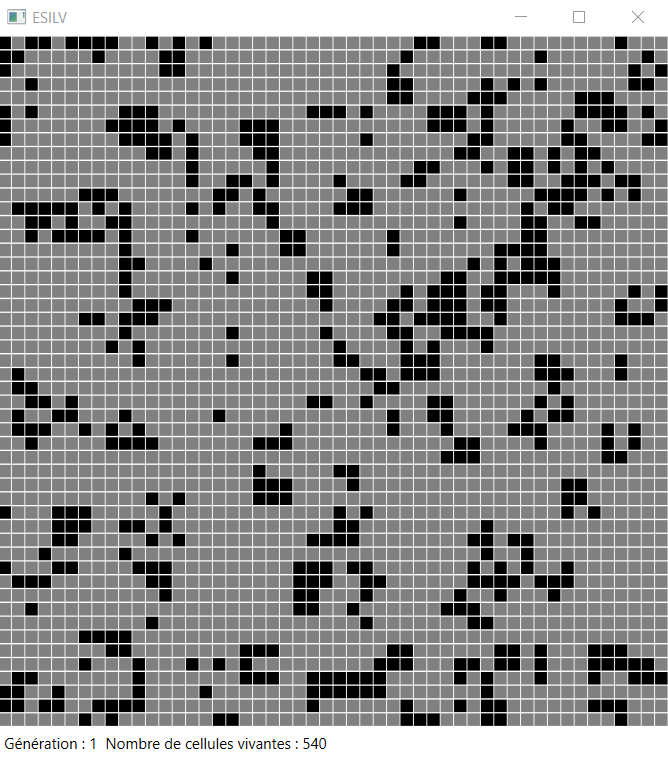

# Jeu-de-la-vie

*Conway's Game of Life with GUI*

**Date de réalisation :** Avril 2018

**Cadre du projet :** Cours "Tableaux et Algorithmes" en 1ère année de prépa intégrée à l'ESILV

**Langage utilisé :** C#

## Présentation du projet

Le jeu de la vie a été imaginé par John Horton Conway vers 1970. C’est un « jeu à zéro joueur » car l’intervention d’aucun joueur n’est nécessaire à son déroulement. Le jeu de la vie se déroule sur une grille à deux dimensions, théoriquement infinie, composée de cases (appelées cellules) qui ont un état binaire (1 pour vivante et 0 pour morte).

Il s’agit d’un automate cellulaire qui repose sur le principe d’évolution de la grille dans le temps. A chaque étape, appelée génération, les cellules évoluent en fonction de leur voisinage et selon des règles spécifiques.

Ne disposant pas d’une grille de dimension infinie, j’ai adopté des conventions pour obtenir une grille circulaire : les bords gauche et droit de la grille, ainsi que les bords haut et bas de la grille, sont connectés.

Pour une population de cellules évoluant sur la grille, nous pouvons voir les états intermédiaires de chaque cellule : celles qui deviendront vivantes à la génération suivante et celles qui deviendront mortes.

<p align="center">
  
  
  
</p>

J’ai également développé une variante du jeu de la vie avec deux populations de cellules distinctes évoluant sur la même grille.

<p align="center">
  
  
  
</p>


## Structure des fichers et utilisation de la GUI

- Créer un nouveau projet "Console Application" dans Visual Studio. Copier le contenu de Program.cs en modifiant le namespace selon le nom donné à votre projet.
- Une fois le projet compilé au moins une fois, vous pouvez utiliser l'interface graphique.
Pour cela, le fichier EsilvGui.dll doit être situé à la racine du projet Visual Studio (au même emplacement que le fichier .sln du projet).
Par exemple, si le projet s'appelle Jeu_de_la_vie :

```dir
│___Jeu_de_la_vie
│       bin
│       obj
│       Properties
│       App.config
│       Program.cs
│       Jeu_de_la_vie.csproj
│
├───EsilvGui.dll
│
└───Jeu_de_la_vie.sln
```

- Ajouter les références "WindowsBase", "PresentationCore", "PresentationFramework", "System.Xaml" ainsi que la référence EsilvGui.dll. (Dans "Explorateur de solution", Clic droit sur "Références" puis "Ajouter une référence" et sélectionner les références ou bien "Parcourir" pour EsilvGui.dll.)

- Aller dans le menu Outils > Options > Débogage > Général et décocher "Activer les outils de débogage d'interface utilisateur pour XAML"

